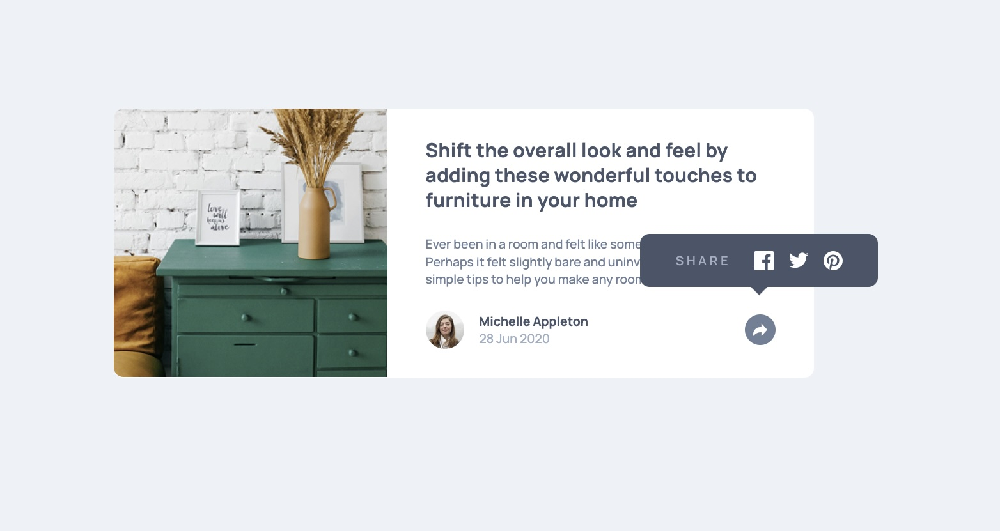

# Frontend Mentor - Article preview component solution

This is a solution to the [Article preview component challenge on Frontend Mentor](https://www.frontendmentor.io/challenges/article-preview-component-dYBN_pYFT). Frontend Mentor challenges help you improve your coding skills by building realistic projects.

## Table of contents

- [Overview](#overview)
  - [The challenge](#the-challenge)
  - [Screenshot](#screenshot)
  - [Links](#links)
- [My process](#my-process)
  - [Built with](#built-with)
  - [What I learned](#what-i-learned)
  - [Useful resources](#useful-resources)
- [Author](#author)

## Overview

### The challenge

Users should be able to:

- View the optimal layout for the component depending on their device's screen size
- See the social media share links when they click the share icon

### Screenshot

### Links

- Solution URL: [Solution](https://github.com/vince4dev/challenge9)
- Live Site URL: [Live site](https://vince4dev.github.io/challenge9/)

## My process

### Built with

- Semantic HTML5 markup
- CSS custom properties
- Flexbox
- CSS Grid
- Mobile-first workflow
- Javascript

### What I learned

- I honed my JavaScript skills by working on the interaction of the "Share" menu.
- I used `addEventListener` to listen for button clicks, then applied `classList.toggle('active')` to show or hide the menu using a CSS class. To ensure accessibility, I added `setAttribute('aria-expanded', true/false)` so that screen readers could detect whether the menu was open or closed.
- This combination of DOM manipulation, CSS animation, and ARIA attributes allowed me to create a smooth and inclusive user experience.

### Useful resources

- [google-webfonts-helper](https://gwfh.mranftl.com/fonts) - This helped me find the font and integrate it into the project.
- [MDN](https://developer.mozilla.org/fr/) - Resources for Developers.

## Author

- Frontend Mentor - [@vince4dev](https://www.frontendmentor.io/profile/vince4dev)
